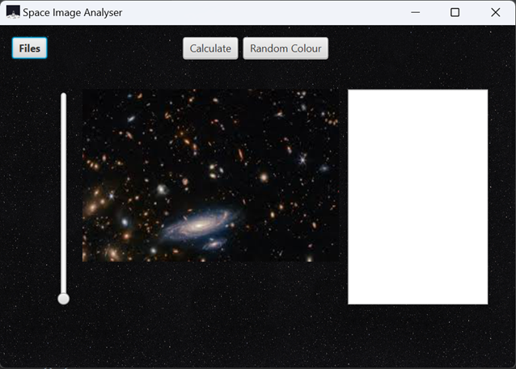
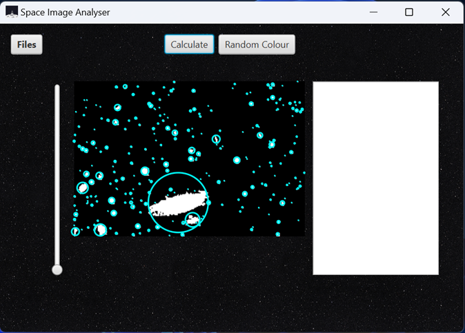
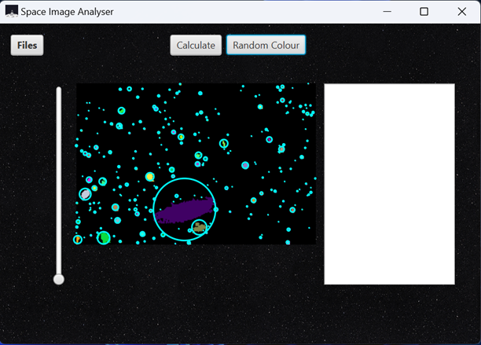
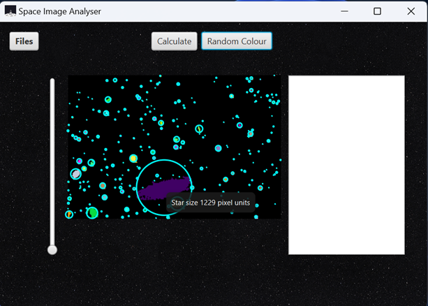

# Star-Cluster-Navigator
 This program allows the user to select an image of space from their file explorer and identify the clusters of stars. The key element of this program is that it uses a Linked list to group like-pixels together to identify the size of each star. 

  

  

  

  

